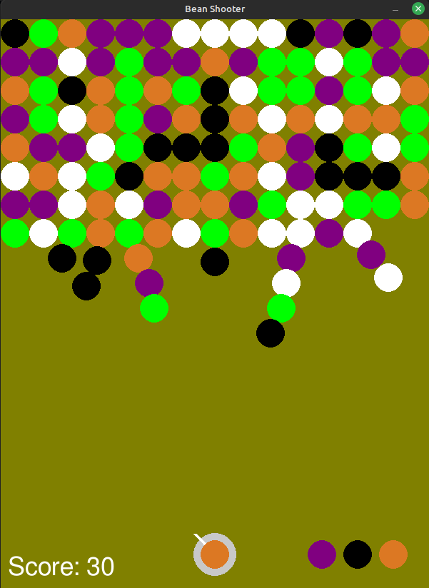

# Ohjelmistotekniikka, harjoitustyö

## BEAN SHOOTER
Bean Shooter on Pygame-kirjastolla toteutettu yksinpeli, jossa pelaaja ampuu värillisiä papuja ruudun yläosaan ja pyrkii muodostamaan kolmen samanvärisen ryhmiä. Kun vähintään kolme samanväristä papua koskettavat toisiaan, ne poistuvat kentältä ja pelaaja saa pisteitä. Jos pelaaja epäonnistuu kolme kertaa peräkkäin osumaan lähelle samanvärisiä papuja, pelikentälle lisätään uusi rivi papuja. Peli päättyy, kun pavut saavuttavat kentän alareunan.

Pelin tavoitteena on selviytyä mahdollisimman pitkään ja kerätä korkein mahdollinen pistemäärä. Eniten pisteitä keräneet saavat nimensä tulostaululle.



## Dokumentaatio
* [Arkkitehtuuri](https://github.com/L-antti/ot-harjoitustyo/blob/main/dokumentaatio/arkkitehtuuri.md)
* [Changelog](https://github.com/L-antti/ot-harjoitustyo/blob/main/dokumentaatio/changelog.md)
* [Käyttöohje](https://github.com/L-antti/ot-harjoitustyo/blob/main/dokumentaatio/kayttoohje.md)
* [Testaus](https://github.com/L-antti/ot-harjoitustyo/blob/main/dokumentaatio/testaus.md)
* [Työaikakirjanpito](https://github.com/L-antti/ot-harjoitustyo/blob/main/dokumentaatio/tyoaikakirjanpito.md)
* [Vaatimusmäärittely](https://github.com/L-antti/ot-harjoitustyo/blob/main/dokumentaatio/vaatimusmaarittely.md)
* [Releases](https://github.com/L-antti/ot-harjoitustyo/releases)


### Asentaminen

1. **Lataa viimeisin [versio](https://github.com/L-antti/ot-harjoitustyo/releases) tai kloonaa repositorio.**
2. **Siirry sovelluksen hakemistoon.**

3. **Asenna riippuvuudet**:
   ```bash
   poetry install
   ```
4. **Käynnistä sovellus**:
   ```bash
   poetry run invoke start
   ```

   
### Komentorivitoiminnot

* **Käynnistää sovelluksen**:
   ```bash
   poetry run invoke start
   ```
* **Suorittaa pytestit**:
  ```bash
   poetry run invoke test
   ```
* **Luo testikattavuus raportin _htmlcov_-hakemistoon**:
   ```bash
   poetry run invoke coverage-report
   ```
* **Suorittaa Pylint tarkistukset**:
   ```bash
   poetry run invoke lint
