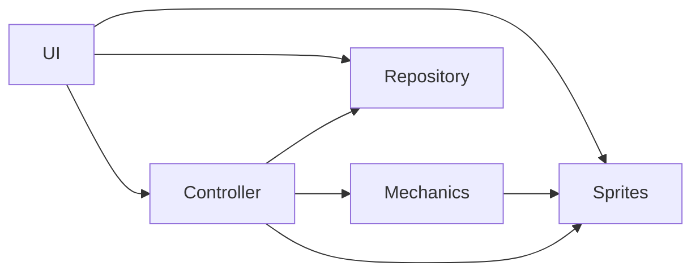
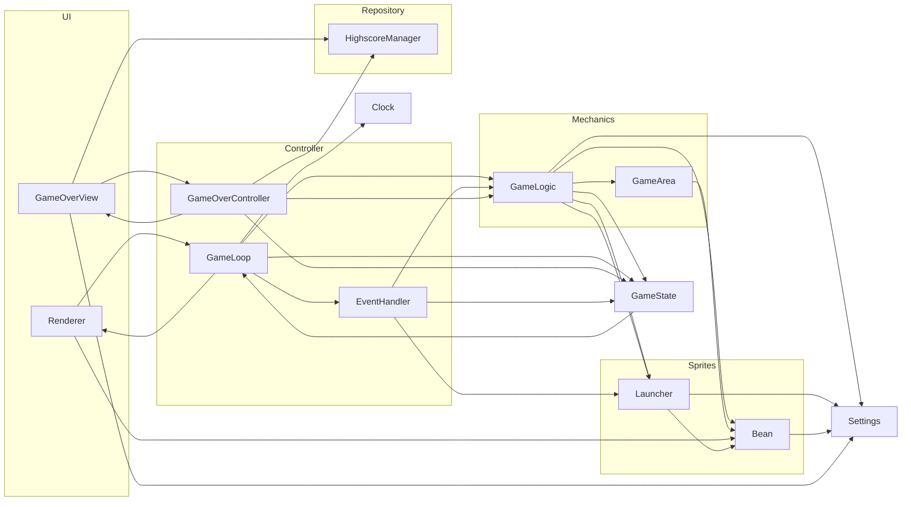
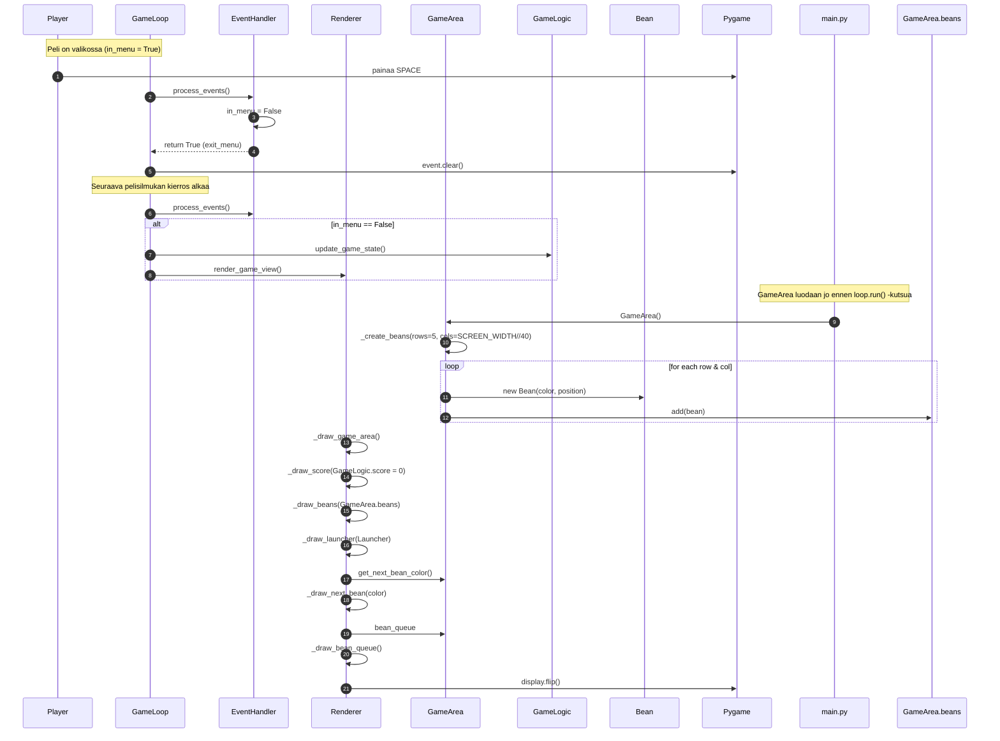
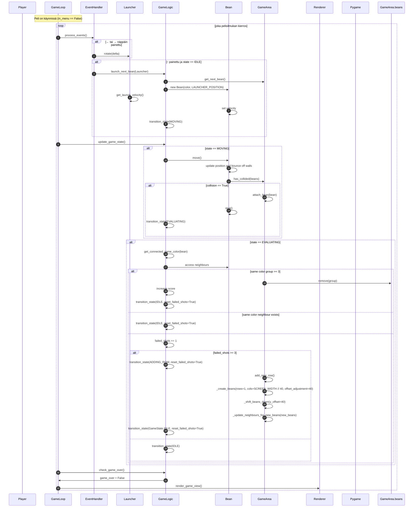
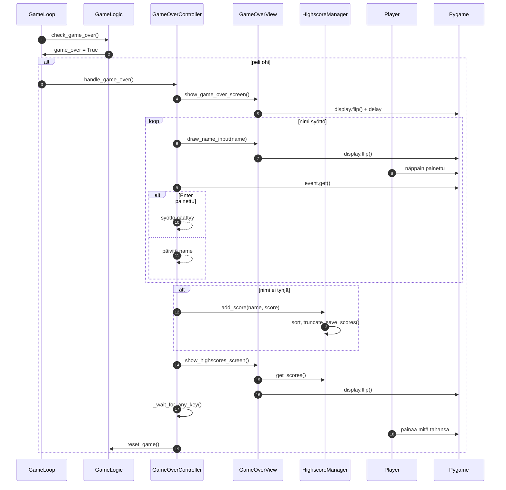

# Arkkitehtuurikuvaus
## Rakenne

Sovelluksen arkkitehtuuri jakautuu viiteen kerrokseen 

* Käyttöliittymäkerros (UI): Tämä kerros on vastuussa pelin visuaalisista näkymistä ja käyttäjän syötteistä. Se toimii rajapintana pelaajan ja pelin muiden osien välillä. Renderer piirtää pelin elementit, ja GameOverView käsittelee pelin loppunäkymän.

* Ohjainkerros (Controller): Tämä kerros ohjaa pelin logiikkaa ja tapahtumien käsittelyä. Se reagoi pelaajan syötteisiin ja päivittää pelin tilan (esim. peli päättyy, peli käynnissä). Se sisältää myös pelisilmukan ja pelin pääsilmukan (GameLoop) ajamisen, sekä pelaajan syötteen lukemisen pelitilanteessa(EventHandler) ja pelin päätyttyä (GameOverController).

* Pelilogiikkakerros (Mechanics): Tämä kerros hoitaa pelin säännöt ja mekaniikan, kuten papujen tarkistaminen, liikkuminen ja rivin lisääminen. Se käyttää GameArea-luokkaa hallitsemaan pelialuetta ja GameLogic-luokkaa, joka sisältää pelin logiikan ja tilanmuutokset.

* Pelihahmokerros (Sprites): Tässä kerroksessa käsitellään pelin objekteja, kuten papuja ja laukaisijaa. Se huolehtii papujen liikkumisesta ja niiden vuorovaikutuksesta pelialueen kanssa.

* Tietovarastokerros (Repository): Tämä kerros on vastuussa tietojen tallentamisesta, kuten parhaista pisteistä.

* Lisäksi löytyy yhteiset tiedot ja asetukset, jotka vaikuttavat muihin kerroksiin. Näitä ovat esimerkiksi GameState (pelin tila), Clock (aikakellon hallinta) ja Settings (pelin asetukset, kuten nopeus ja värit).
  

## Käyttöliittymä
Sovelluksessa on viisi erilaista näkymää:

* Alkunäkymä, jossa kerrotaan pelin säännöt ja siirrytään pelaamaan painamalla välilyöntiä.

* Pelinäkymä, jossa pelaaja voi ampua papuja ja nähdä nykyisen pistemäärän.

* Game over -näkymä, joka ilmoittaa pelin päättymisestä. Se piirretään hetkellisesti pelinäkymän päälle.

* Nimen syöttönäkymä, jossa pelaaja voi syöttää nimensä tulosta varten.
* Highscore-näkymä, jossa näytetään kymmenen parasta tulosta.

Käyttöliittymä saa pelitilanteen tilatiedot (GameState) ohjainkerrokselta, jolloin se piirtää kulloisenkin näkymän tämän tilan perusteella ilman, että ohjainkerros määrittelee suoraan mitä piirretään. Käyttöliittymä on pyritty erottamaan pelilogiikasta, ja se toimii puhtaasti tiedon esittäjänä.
Käyttöliittymä on edelleen jaettu omiin osakomponentteihinsa: esimerkiksi pelin päättymisestä vastaava näkymä on erillisessä luokassa. Pelinäkymän piirtämisestä vastaava luokka on tiiviisti yhteydessä pelihahmokerroksen Bean-luokkaan, koska se käsittelee papujen piirtämistä ruudulle.
Lisäksi käyttöliittymä hyödyntää pygame-kirjaston renderöintiominaisuuksia suoraan, kuten display.flip() ja fonttipiirtoa.

## Tietojen tallentaminen
Kymmenen parasta tulosta tallennetaan nimen ja pistemäärän kanssa highscores.json tiedostoon.

## Päätoiminnallisuudet
Päätöiminnallisuudet esitettynä sekvenssikaavioina

### Pelin aloitus

Pelin alussa pelaaja siirtyy alkunäkymästä pelitilaan painamalla välilyöntiä. Tällöin alustetaan pelilogiikka ja luodaan pelikentälle ensimmäiset pavut. Renderer piirtää alkuasetelman ruudulle, mukaan lukien pavut, pisteet ja laukaisija.

### Pelaaminen

Pelaaminen tapahtuu jatkuvassa silmukassa, jossa käsitellään syötteitä, päivitetään pelilogiikkaa ja piirretään näkymä. Pelaaja voi kääntää laukaisijaa ja ampua papuja. Papu liikkuu ja törmää muihin papuihin, minkä jälkeen päivitetään kiinnittyneet naapurit, tarkastellaan pisteiden saamista tai uuden rivin lisäämistä epäonnistuneiden laukausten perusteella.

### Pelin päättyminen

Peli päättyy, jos joku papu saavuttaa kentän alareunan. Tällöin näytetään pelinlopetusnäkymä ja pelaajalta pyydetään nimi tulostaulukkoa varten. Jos nimi annetaan, se tallennetaan, ja näytetään parhaat tulokset. Lopuksi peli odottaa pelaajan syötettä uuden pelin aloittamiseksi.

