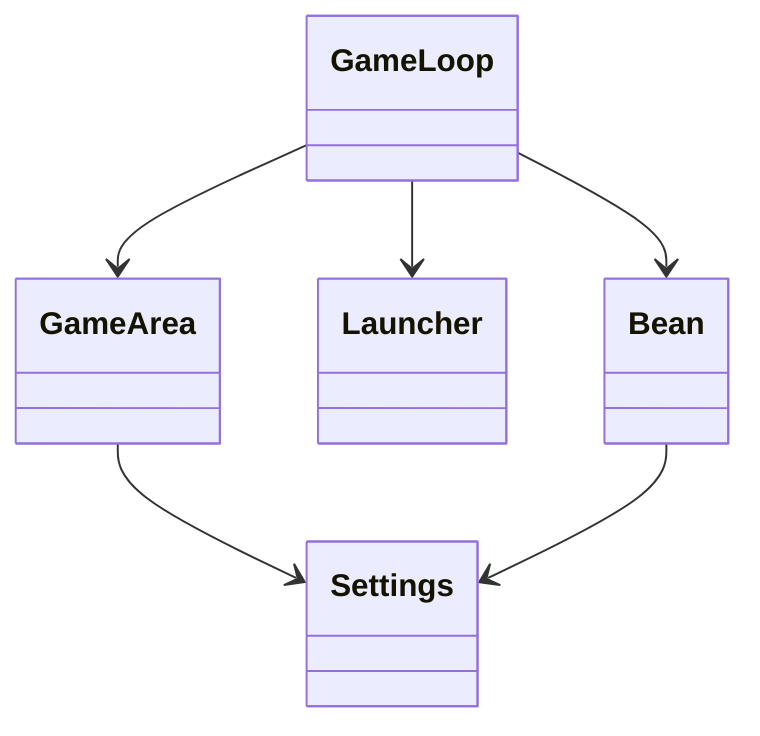

```mermaid

classDiagram
    %% Game Loop
    class GameLoop {
    }

    %% Sprites Package
    class Bean {
    }
    class Launcher {
    }

    %% Game Area Package
    class GameArea {
    }

    %% Settings Package
    class Settings {

    }

    %% Relationships
    GameLoop --> Bean
    GameLoop --> Launcher
    GameLoop --> GameArea
    GameArea --> Settings
    Bean --> Settings

```

