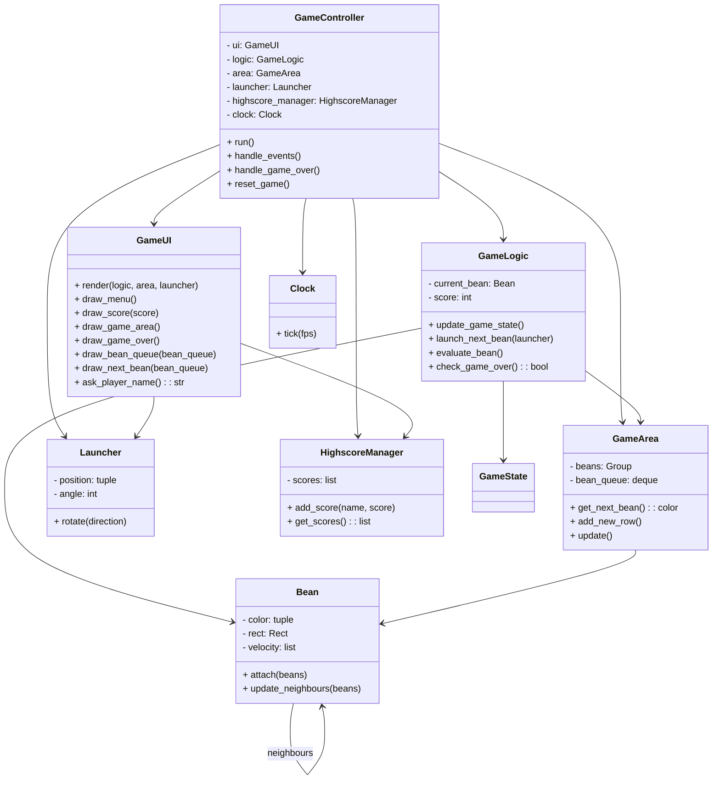
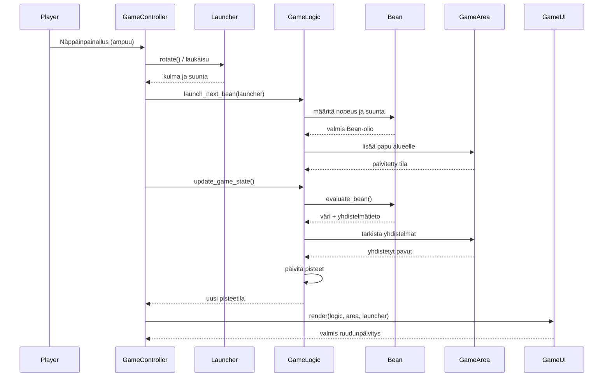

```mermaid
classDiagram

class GameController {
    - ui: GameUI
    - logic: GameLogic
    - area: GameArea
    - launcher: Launcher
    - highscore_manager: HighscoreManager
    - clock: Clock
    + run()
    + handle_events()
    + handle_game_over()
    + reset_game()
}

class GameUI {
    + render(logic, area, launcher)
    + draw_menu()
    + draw_score(score)
    + draw_game_area()
    + draw_game_over()
    + draw_bean_queue(bean_queue)
    + draw_next_bean(bean_queue)
    + ask_player_name(): str
}

class GameLogic {
    - current_bean: Bean
    - score: int
    + update_game_state()
    + launch_next_bean(launcher)
    + evaluate_bean()
    + check_game_over(): bool
}

class GameArea {
    - beans: Group
    - bean_queue: deque
    + get_next_bean(): color
    + add_new_row()
    + update()
}

class Bean {
    - color: tuple
    - rect: Rect
    - velocity: list
    + attach(beans)
    + update_neighbours(beans)
}

class Launcher {
    - position: tuple
    - angle: int
    + rotate(direction)
}

class HighscoreManager {
    - scores: list
    + add_score(name, score)
    + get_scores(): list
}

class Clock {
    + tick(fps)
}

GameController --> GameUI
GameController --> GameLogic
GameController --> GameArea
GameController --> Launcher
GameController --> HighscoreManager
GameController --> Clock

GameLogic --> Bean
GameLogic --> GameArea
GameLogic --> GameState

GameArea --> Bean
GameUI --> Launcher
GameUI --> HighscoreManager
Bean --> Bean : neighbours


```

```mermaid
sequenceDiagram
    participant Player
    participant GameController
    participant Launcher
    participant GameLogic
    participant Bean
    participant GameArea
    participant GameUI

    Player->>GameController: Näppäinpainallus (ampuu)
    GameController->>Launcher: rotate() / laukaisu
    Launcher-->>GameController: kulma ja suunta

    GameController->>GameLogic: launch_next_bean(launcher)
    GameLogic->>Bean: määritä nopeus ja suunta
    Bean-->>GameLogic: valmis Bean-olio

    GameLogic->>GameArea: lisää papu alueelle
    GameArea-->>GameLogic: päivitetty tila

    GameController->>GameLogic: update_game_state()
    GameLogic->>Bean: evaluate_bean()
    Bean-->>GameLogic: väri + yhdistelmätieto

    GameLogic->>GameArea: tarkista yhdistelmät
    GameArea-->>GameLogic: yhdistetyt pavut

    GameLogic->>GameLogic: päivitä pisteet
    GameLogic-->>GameController: uusi pisteetila

    GameController->>GameUI: render(logic, area, launcher)
    GameUI-->>GameController: valmis ruudunpäivitys
```
