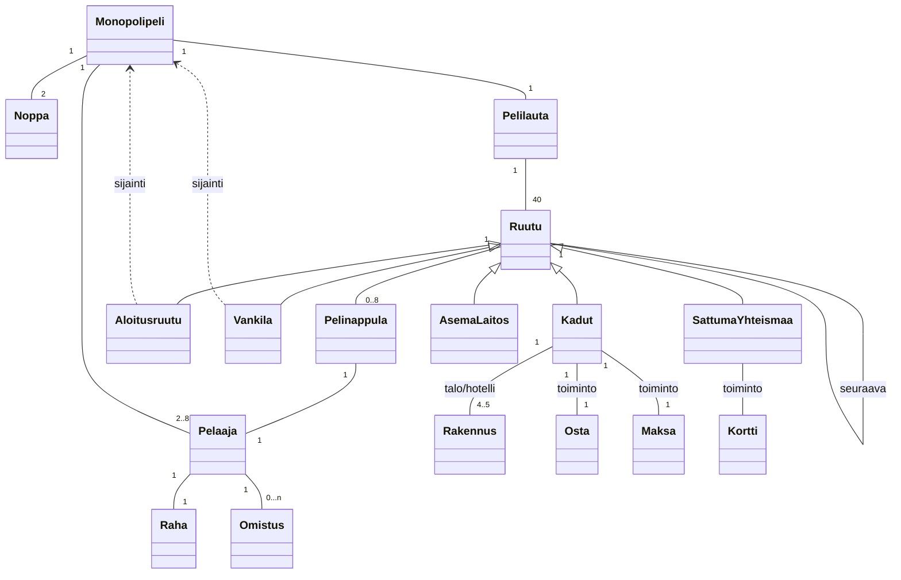

```mermaid
classDiagram
    Monopolipeli "1" -- "2" Noppa
    Monopolipeli "1" -- "1" Pelilauta
    Pelilauta "1" -- "40" Ruutu
    Ruutu "1" -- Ruutu : seuraava
    Ruutu "1" -- "0..8" Pelinappula
    Pelinappula "1" -- "1" Pelaaja
    Pelaaja "2..8" -- "1" Monopolipeli

    Pelaaja "1" -- "1" Raha
    Pelaaja "1" -- "0...n" Omistus

    Ruutu <|-- Aloitusruutu
    Ruutu <|-- Vankila
    Ruutu <|-- SattumaYhteismaa
    Ruutu <|-- AsemaLaitos
    Ruutu <|-- Kadut

    Kadut "1" -- "4..5" Rakennus : talo/hotelli
    Kadut "1" -- "1" Osta: toiminto
    Kadut "1" -- "1" Maksa: toiminto

    SattumaYhteismaa -- Kortti : toiminto

    Aloitusruutu ..>  Monopolipeli: sijainti
    Vankila ..> Monopolipeli : sijainti

    


```
