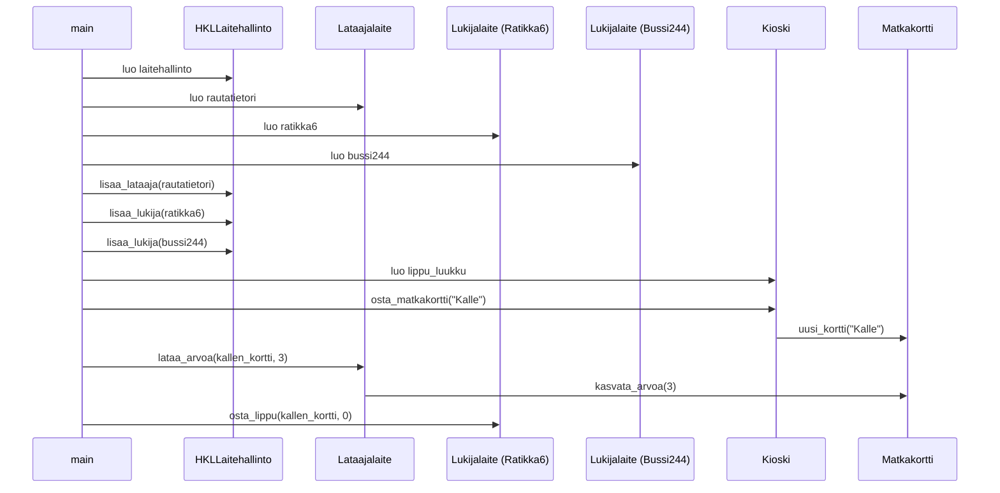

```mermaid
sequenceDiagram
    participant main
    participant HKLLaitehallinto
    participant Lataajalaite
    participant ratikka6 as Lukijalaite (Ratikka6)
    participant bussi244 as Lukijalaite (Bussi244)
    participant Kioski
    participant Matkakortti

    main->>HKLLaitehallinto: luo laitehallinto
    main->>Lataajalaite: luo rautatietori
    main->>ratikka6: luo ratikka6
    main->>bussi244: luo bussi244

    main->>HKLLaitehallinto: lisaa_lataaja(rautatietori)
    main->>HKLLaitehallinto: lisaa_lukija(ratikka6)
    main->>HKLLaitehallinto: lisaa_lukija(bussi244)

    main->>Kioski: luo lippu_luukku
    main->>Kioski: osta_matkakortti("Kalle")
    Kioski->>Matkakortti: uusi_kortti("Kalle")

    main->>Lataajalaite: lataa_arvoa(kallen_kortti, 3)
    Lataajalaite->>Matkakortti: kasvata_arvoa(3)
    

    main->>ratikka6: osta_lippu(kallen_kortti, 0)

```

